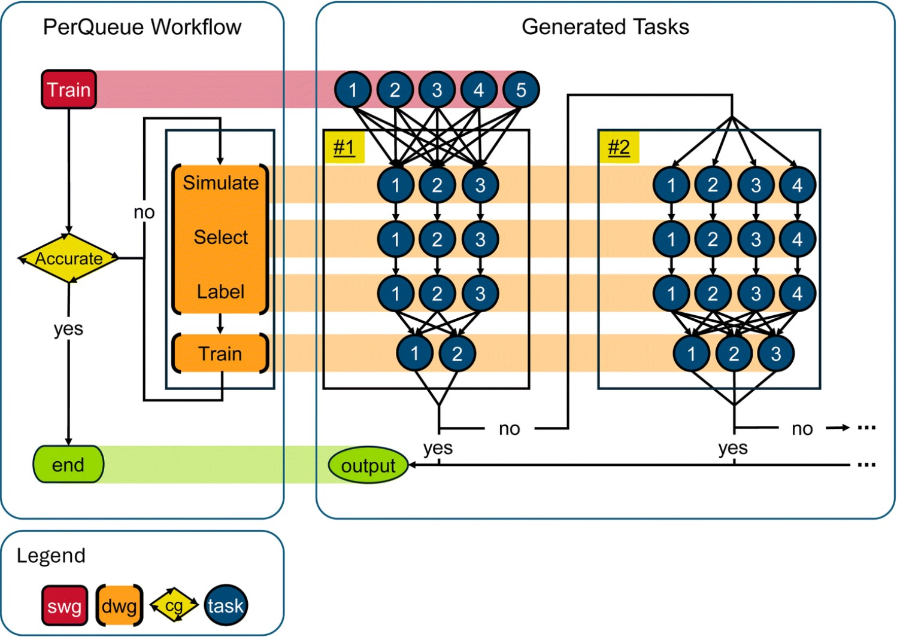

# auto-cPaiNN
Auto-cPaiNN is a an active learning workflow for training the [cPaiNN](https://github.com/dtu-energy/cPaiNN) model on a specific phase space. It is based on [Curator](https://doi.org/10.26434/chemrxiv-2024-p5t3l) and initialized using [PerQueue](https://doi.org/10.1039/D4DD00134F). Please side all three papers when using this workflow.

To provide an example workflow, data have been provided from the [the polyanaion sodium cathode dataset](https://doi.org/10.11583/DTU.27202446) and should be cited using doi: 0.11583/DTU.27202446. To get the training data for tge cPaiNN model, please download it at the [database](https://doi.org/10.11583/DTU.27202446).

To run cPaiNN please download the dependincies:
```bash
pip install -r requirement.txt
```
Please also use the PerQueue version in the repository. 


The workflow diagram is vizualized below and comes from the [PerQueue paper](https://doi.org/10.1039/D4DD00134F) :



## How to use the workflow
The workflow consist of four steps.
1) train: Train the machine learning potential (MLP)
2) simulate: Use the trained MLP to perform a simulation. Molecular dynamics(MD) and Nugded elastic band(NEB) are supported
3) select: Use batch active learning to pick a diverse and informative sample set from the MLP simulation
4) labeling: Do single point DFT on the sampled set and add the data to the training set
These four steps are continued untill the user decide that a satisfactory result have been achieved. 

All parameters for these steps are set in the "config.toml". The parameters shoudl eitehr be self explantory or explained in the file. 
IMPORTANT: The stuctures picked in simulate goes trough step 2-4 so do not change the name of the structure. For example "NaFePO4" and "NaFePO4_NEB" are names for two different systems and should not be changed doing the workflow. More/less systems can be added/removed and will then be included in the begining of the next iteration of the workflow.
Also note that for each system one can change the main parameters of the workflow step, but a "dummy" parameter needs to be added to the main parameters. This is especially important for the "labeling" step and the VASP parameters.

To initialize the workflow, one needs first to initialize PerQueue and MyQueue.
To initialize PerQueue
```bash
pq init
```
To initialize MyQueue
```bash
mq init
```
The code is set at the moment to use local computer resources but different HPC cluster settings can be added. A set of HPC configuration files are presented in (https://github.com/dtu-energy/Myqueue-for-HPC).

To run the code the user needs to change the paths in config.toml to their specific locations.
When everything is set one initialize the workflow by performing the command:
```bash
python pq_submit.py
```